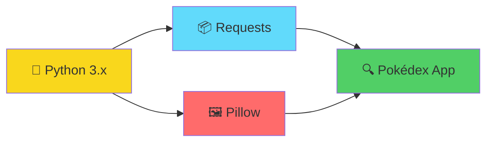
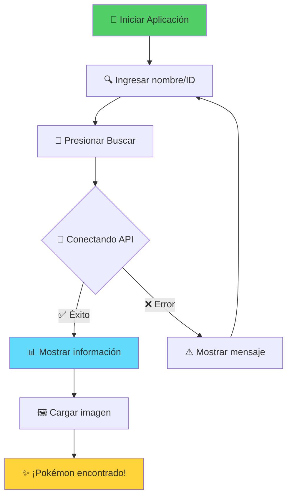

<div align="center">
  
</div>

<h1 align="center">
  
</h1>

<div align="center">
  
  
  
  
  
  
</div>

<div align="center">
  
</div>

## 📖 Descripción

<div align="center">
  
</div>

---

## 📷 Vista previa

<div align="center">
  <h3>🎮 Interfaz Principal</h3>
  
  
</div>

<div align="center">
  
</div>

---

## ⚡ Características

<div align="center">

| 🔍 **Búsqueda Avanzada** | 📊 **Información Completa** | 🖼️ **Imágenes HD** | 🔄 **Interfaz Fluida** |
|:---:|:---:|:---:|:---:|
| Por nombre o ID | Estadísticas detalladas | Arte oficial de Pokémon | Sin bloqueos con threading |

</div>

<details>
<summary>🎯 <strong>Ver todas las características</strong></summary>

```
✅ Búsqueda por nombre o ID
✅ Información detallada: nombre, ID, tipo, altura, peso
✅ Estadísticas completas de combate
✅ Lista de habilidades del Pokémon
✅ Carga de imágenes desde PokeAPI
✅ Arte oficial de alta calidad
✅ Interfaz limpia con scroll vertical
✅ Threading para búsquedas no bloqueantes
✅ Manejo de errores robusto
✅ Interfaz responsive
```

</details>

---

## 🧰 Requisitos del Sistema

<div align="center">



</div>

### 📋 Dependencias

| Librería | Versión | Propósito |
|----------|---------|-----------|
|  | `latest` | Consumo de PokeAPI |
|  | `latest` | Procesamiento de imágenes |

---

## 🚀 Instalación Rápida

<div align="center">
  
</div>

### Paso 1: 🐍 Verificar Python
```bash
python --version
```

### Paso 2: 📦 Instalar dependencias
```bash
pip install requests pillow
```

### Paso 3: 🎮 Ejecutar la aplicación
```bash
python pokedex.py
```

<div align="center">
  
</div>

---

## 🎮 Cómo usar

<div align="center">



</div>

---

## 🔧 Arquitectura del Proyecto

<details>
<summary>📂 <strong>Estructura de archivos</strong></summary>

```
pokedex-tkinter/
├── 📄 pokedex.py          # Archivo principal
├── 📄 README.md           # Este archivo
├── 📄 LICENSE             # Licencia MIT
├── 📂 assets/             # Recursos gráficos
│   └── 🖼️ logo.png        # Logo del proyecto
└── 📂 screenshots/        # Capturas de pantalla
    ├── 🖼️ preview1.png
    └── 🖼️ preview2.png
```

</details>

---

## 🤝 Contribuciones

<div align="center">
  
</div>

1. 🍴 Fork el proyecto
2. 🌿 Crea una nueva rama (`git checkout -b feature/nueva-caracteristica`)
3. 💾 Commit tus cambios (`git commit -m 'Agregar nueva característica'`)
4. 📤 Push a la rama (`git push origin feature/nueva-caracteristica`)
5. 🔄 Abre un Pull Request

---

## 📊 Estadísticas del Proyecto

<div align="center">
  
</div>

---

## 🙏 Agradecimientos

<div align="center">
  
  **Gracias a:**
  
  [](https://pokeapi.co/)
  [](https://python.org/)
  [](https://docs.python.org/3/library/tkinter.html)
  
</div>

---

## 📄 Licencia

<div align="center">
  
</div>

Este proyecto está licenciado bajo la Licencia MIT - consulta el archivo [LICENSE](LICENSE) para más detalles.

---

<div align="center">
  
  
  **⭐ ¡Si te gusta el proyecto, no olvides darle una estrella! ⭐**
  
  
</div>
