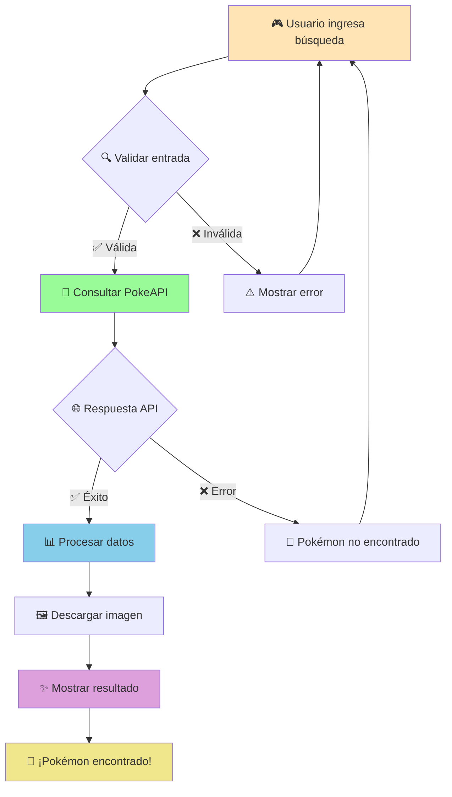

<!-- Header con animación de ondas -->
<div align="center">
  
</div>

<div align="center">
  
  <!-- Badges animados con pulse -->
  <a href="#"></a>
  <a href="#"></a>
  <a href="#"></a>
  
  <br><br>
  
  <!-- Contador de visitantes animado -->
  
  
</div>

<!-- Separador animado -->


## 🌟 **Acerca del Proyecto**

<table>
<tr>
<td width="50%">

### 🎯 **¿Qué es esto?**

Una **Pokédex interactiva** construida con Python que te permite:

- 🔍 **Buscar** cualquier Pokémon
- 📊 **Visualizar** sus estadísticas
- 🖼️ **Ver** imágenes oficiales
- ⚡ **Navegar** sin interrupciones

</td>
<td width="50%">

<div align="center">
  
</div>

</td>
</tr>
</table>

## 🚀 **Demo en Acción**

<div align="center">
  
  <!-- Slider de capturas con efecto hover -->
  
  
  
  <br>
  
  <sub>🖱️ <i>Interfaz limpia y moderna para la mejor experiencia de usuario</i></sub>
  
</div>

<!-- Línea divisora ondulada -->


## ⚡ **Características Principales**

<div align="center">

<!-- Grid de características con iconos -->
| 🔎 Búsqueda Inteligente | 📈 Estadísticas Completas | 🎨 Interfaz Moderna | 🔄 Actualizaciones en Tiempo Real |
|:---:|:---:|:---:|:---:|
| Busca por nombre o número | Stats de combate detalladas | Diseño minimalista | Sin bloqueos ni esperas |

</div>

### 🎮 **Funcionalidades Avanzadas**

```yaml
🔹 Búsqueda:
  - Por nombre (ej: "pikachu")
  - Por ID numérico (ej: "25")
  - Búsqueda insensible a mayúsculas

🔹 Información mostrada:
  - Datos básicos (nombre, ID, tipos)
  - Medidas físicas (altura, peso)
  - Estadísticas de combate
  - Habilidades especiales
  - Imagen oficial de alta calidad

🔹 Tecnología:
  - Threading para rendimiento
  - Manejo robusto de errores
  - Cache inteligente de imágenes
```

<!-- Separador con gradiente -->


## 🛠️ **Instalación Express**

<div align="center">

### 📦 **Método Rápido**

</div>

<table>
<tr>
<td width="50%">

**1️⃣ Clonar el repositorio**
```bash
git clone https://github.com/N1coTom55/pokedex-tkinter.git
cd pokedex-tkinter
```

**2️⃣ Instalar dependencias**
```bash
pip install -r requirements.txt
```

**3️⃣ Ejecutar la aplicación**
```bash
python pokedex.py
```

</td>
<td width="50%">

<div align="center">
  
</div>

</td>
</tr>
</table>

### 🧾 **Dependencias Requeridas**

<div align="center">

| Paquete | Versión | Uso |
|---------|---------|-----|
|  | `3.8+` | Lenguaje base |
|  | `latest` | HTTP requests |
|  | `latest` | Procesamiento de imágenes |

</div>

<!-- Línea divisora -->


## 🎯 **Cómo Funciona**

<div align="center">



</div>

<!-- Separador especial -->
<div align="center">
  
</div>

## 🤝 **Contribuir al Proyecto**

<details>
<summary>📋 <strong>Guía de Contribución</strong></summary>

### 🌟 **Formas de Contribuir**

- 🐛 **Reportar bugs** - Abre un issue
- 💡 **Sugerir features** - Comparte tus ideas
- 🔧 **Enviar Pull Requests** - Mejora el código
- 📖 **Mejorar documentación** - Ayuda a otros usuarios

### 🚀 **Proceso de Contribución**

1. **Fork** este repositorio
2. **Crea** una rama para tu feature (`git checkout -b feature/awesome-feature`)
3. **Commit** tus cambios (`git commit -m 'Add awesome feature'`)
4. **Push** a tu rama (`git push origin feature/awesome-feature`)
5. **Abre** un Pull Request

</details>

<!-- Estadísticas del proyecto -->
<div align="center">

## 📊 **Estadísticas del Proyecto**


</div>

<!-- Footer con ondas -->
<div align="center">
  
  
  
  <br>
  
  **Hecho con ❤️ y mucho ☕**
  
  <sub>© 2024 - Pokédex Tkinter Project</sub>
  
  <br><br>
  
  [](https://github.com/N1coTom55)
  [](#)
  [](#)
  
</div>

<!-- Easter egg oculto -->
<!-- 
⠀⠀⠀⠀⠀⠀⠀⠀⠀ ⠀⠀⣀⣤⣤⣄⡀⠀⠀⠀⠀⠀⠀⠀⠀⠀
⠀⠀⠀⠀⠀⠀⠀⠀⠀⠀⠀⣿⣿⣿⣿⣿⣿⡄⠀⠀⠀⠀⠀⠀⠀⠀
⠀⠀⠀⠀⠀⠀⠀⠀⠀⠀⠀⢿⣿⣿⣿⣿⣿⡟⠀⠀⠀⠀⠀⠀⠀⠀
⠀⠀⠀⠀⠀⠀⠀⠀⠀⠀⠀⠘⠛⠿⠿⠿⠛⠃⠀⠀⠀⠀⠀⠀⠀⠀
⠀⠀⠀⠀⠀⠀⠀⠀⠀⠀⠀⠀⠀Pikachu⠀⠀⠀⠀⠀⠀⠀⠀⠀
⠀⠀⠀⠀⠀⠀⠀⠀⠀⠀⠀was here! ⚡⠀⠀⠀⠀⠀⠀⠀⠀
-->

---

<div align="center">
  
</div>
